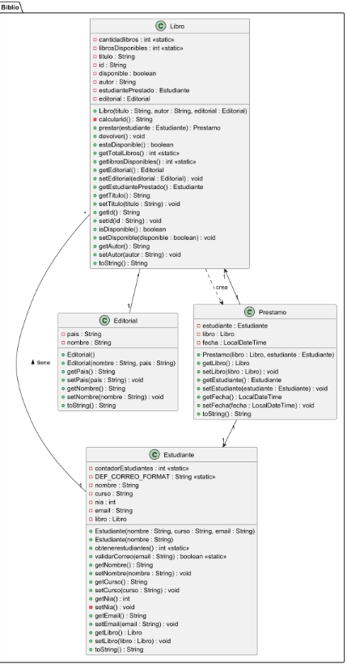

# Practica 1. practica de compra-venta de casas

## ÍNDICE
1. [Intro](#1-introd)
2. [Estructura de clases](#2-estructura-de-clases)
3. [Programa principal (Inmobiliaria APP)](#3-programa-principal-biblioteca-app)
4. [Pruebas](#4-pruebas)
5. [Entrega](#5-entrega)

### 1. Introd
> La practica consiste de una app para sacar habitaciones 

### 2. Estructura de clases 

> [!NOTE]
> Useful information that users should know, even when skimming content.

> [!TIP]
> Helpful advice for doing things better or more easily.

> [!IMPORTANT]
> Key information users need to know to achieve their goal.

> [!WARNING]
> Urgent info that needs immediate user attention to avoid problems.

> [!CAUTION]
> Advises about risks or negative outcomes of certain actions.

### 3. Programa principal (Biblioteca APP) 


### 4. Pruebas 

``````````

@startuml

@startuml
package Biblio {

class Editorial {
    - pais : String
    - nombre : String
    + Editorial()
    + Editorial(nombre : String, pais : String)
    + getPais() : String
    + setPais(pais : String) : void
    + getNombre() : String
    + setNombre(nombre : String) : void
    + toString() : String
}

class Estudiante {
    - contadorEstudiantes : int <<static>>
    - DEF_CORREO_FORMAT : String <<static>>
    - nombre : String
    - curso : String
    - nia : int
    - email : String
    - libro : Libro
    + Estudiante(nombre : String, curso : String, email : String)
    + Estudiante(nombre : String)
    + obtenerestudiantes() : int <<static>>
    + validarCorreo(email : String) : boolean <<static>>
    + getNombre() : String
    + setNombre(nombre : String) : void
    + getCurso() : String
    + setCurso(curso : String) : void
    + getNia() : int
    - setNia() : void
    + getEmail() : String
    + setEmail(email : String) : void
    + getLibro() : Libro
    + setLibro(libro : Libro) : void
    + toString() : String
}

class Libro {
    - cantidadlibros : int <<static>>
    - librosDisponibles : int <<static>>
    - titulo : String
    - id : String
    - disponible : boolean
    - autor : String
    - estudiantePrestado : Estudiante
    - editorial : Editorial
    + Libro(titulo : String, autor : String, editorial : Editorial)
    - calcularid() : String
    + prestar(estudiante : Estudiante) : Prestamo
    + devolver() : void
    + estaDisponible() : boolean
    + getTotalLibros() : int <<static>>
    + getlibrosDisponibles() : int <<static>>
    + getEditorial() : Editorial
    + setEditorial(editorial : Editorial) : void
    + getEstudiantePrestado() : Estudiante
    + getTitulo() : String
    + setTitulo(titulo : String) : void
    + getId() : String
    + setId(id : String) : void
    + isDisponible() : boolean
    + setDisponible(disponible : boolean) : void
    + getAutor() : String
    + setAutor(autor : String) : void
    + toString() : String
}

class Prestamo {
    - estudiante : Estudiante
    - libro : Libro
    - fecha : LocalDateTime
    + Prestamo(libro : Libro, estudiante : Estudiante)
    + getLibro() : Libro
    + setLibro(libro : Libro) : void
    + getEstudiante() : Estudiante
    + setEstudiante(estudiante : Estudiante) : void
    + getFecha() : LocalDateTime
    + setFecha(fecha : LocalDateTime) : void
    + toString() : String
}

Estudiante "1" -- "*" Libro : tiene >
Libro "*" -- "1" Editorial
Prestamo "1" --> "1" Libro
Prestamo "1" --> "1" Estudiante
Libro ..> Prestamo : crea

}
@enduml


@enduml

``````````

### 5. Entrega 

- [X] Código fuente en GitHub: ()
- [ ] Ns que poner
- [ ] Holaaaaa

